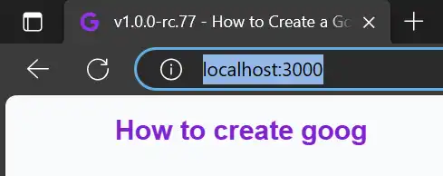

# Setup and install
*How can we use this nuxt layer as a template and create our own app and publish it on Google App Store? I will tell you everything you need to know, as to a child that never have writed any code in your life.*
 
## Setup
If you are a open-cource-developer, you have probably downloaded ant installed some repos from GitHub or GitLab.

This step is for they who isn't there yet, they who need someone to show them the way.

### Node
It is requried to install a develper environment on the local mashine. We need the most basic envirnoment, `node`.[^1]

Download and follow the instruction on the homepage to [node](https://nodejs.org/en/download){:target="_blank"}.

### CMD - VS Code
Now you are ready to open up the CMD. (Everything that happens in `node` happends in CMD.)

If you don't know how to use CMD,you should install `Visual Studio Code`. Its necessary to have when we will edit or write code and content (later in this tutorial).
- Visual Studio Code have a window that is called `Terminal`. In this window we can write node-commands and see everything that happens in `node`. Another window showing directories and another showing content of readable files.

Download Visual Studio Code [here](https://code.visualstudio.com/){:target="_blank"}

NB! Both `node` and `Visual Studio Code` is totally free, and the tools that are most used by programmers.

Now we are ready to go on to the install-fase:

## Download & install
Start with downloading and the install it in the normal way.

### Download
The easiest way is to download this package as it is. Unzip the downloaded file and copy it to a local _github_-folder. Then you can rename the folder to a name you want as a subdomene to vercel. Check if the name isn't busy. [Read more here about it](/article/setup-and-deploy/deploy/github-and-vercel#check-if-a-subdomene-isnt-busy).

### Install
_Intro for beginners_
To install you can open up the VS Code and select `Open Folder` in the `File`, and in this window you can select the folder you want to be parent (dont click **select** yet), rightclick and create a new folder with name _GitHub_ - and then you select _GitHub_ and your copy of my repo in _VS Code_.

Now you have the possibillity to open the `terminal` and do some node-commands.
First we have to install the dependencies in the package-json-file.

```bash
# npm (If you haven't installed yarn or pnpm)
npm install
```

### Dev-server
```bash
# Test if all is working with:
npm run dev
```
You will see a similar picture like this, in the terminal:
{.border-solid .border-4}

When you are running this dev-command you are starting a node-server that makes it possible to use the browser to look on the website, as it was on a server out on the internet (without internet-connection).

No you can open your browser and write the following url:  
`localhost:3000`
{.border-solid .border-4 width="300"}

Then the website will loads. 

## Installing bubblewrap
There are also one another package we need to install. We don't need it before after the website is published to GitHub and Vercel. 

Please install bubblewrap globally (with the `-g`-word), if you want to create more than this app.[^2]
```bash
# Installing bubblewrap
npm install -g bubblewrap
```
## Notes

[^1]: There can be many kinds of environments, depending of what programming-language or framework you want to use. To download and install repos from GitHub we need `node`.

[^2]: Remember you get lifetime access to _Google Play Console_ for 25 dollar, and think about your first app as a learning-project. 

<!-- 
Made by laywer Kyrie Eleison 2023.
-->