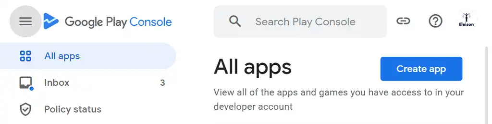
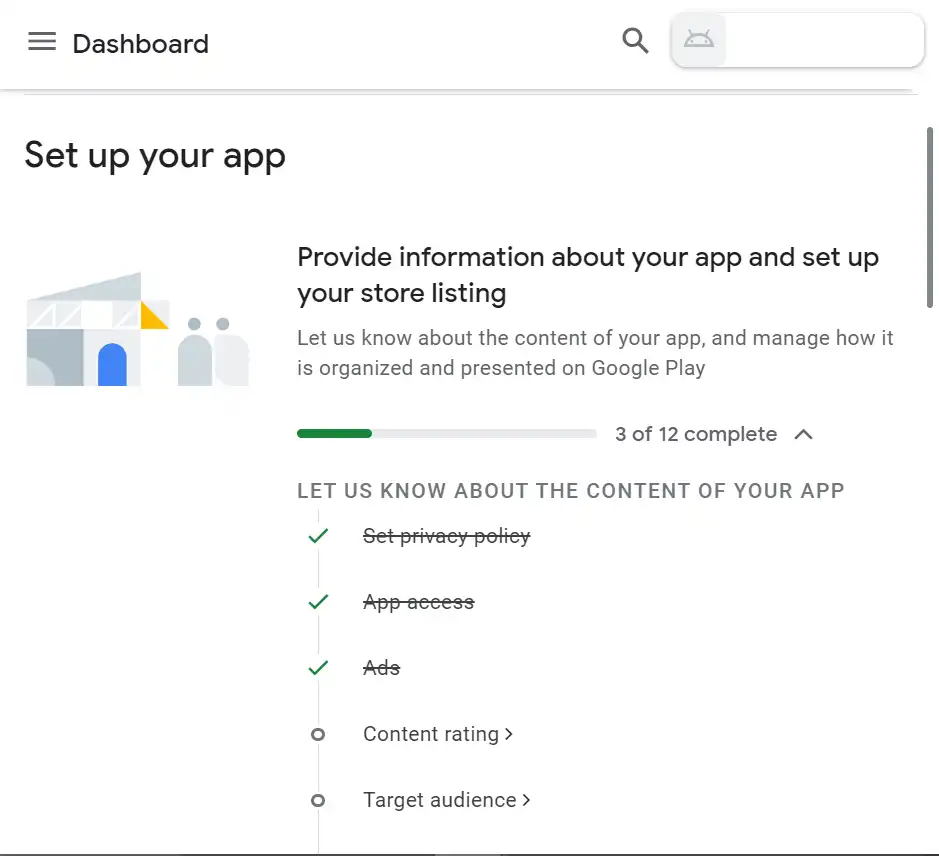

# Google Play Console
When we have created the app with bubblewrap, then we can go on to `Goole Play console`. You need an google account to get access to the Play Console. Be aware of that publishing apps isn't totally free. To get lifetime access, you have to pay 25 dollar. Then you can publish apps the rest of your life, without paying anything. It's everything or nothing.

## The Play Console
_Image: Here we se a minimal screen clip of the console:_
{.border-solid .border-4}

When you have deside a name of the app, its just to start adding the app. Google will try to guide you trough the prosess.

Here is the first screen you should find and start with (screen clip):
{.border-solid .border-4}

## Images
If all the images in the manifest is inserted, you can take from this images and insert into _Play Console_, except one picture. The size of this one is 1024x500.

The format is png or jpg. Play Console dosn't allow other formats of any images.

## Send to review
Google will guide you trough the prosess, and when all is done you have to send everything to Google to review. The review-prosess will take about 7 days. 

## Problems?
This guidelines is written to guide me, and there is a lot more that need to be said to people with less experience and knowledge than me. 

Please take contact with me if you have problem. I will be happe to help you. 

Click my name [`Kyrie Eleison`](mailto:jur.eleison@gmail.com){:target="_blank"} to write e-mail to me.

<!-- 
Made by laywer Kyrie Eleison 2023.
-->